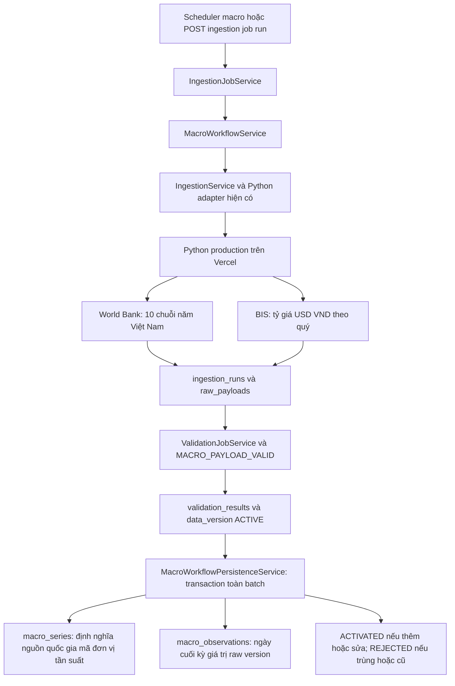

# Luồng macro Việt Nam

Bằng chứng ngày **09/10/2026**. Refresh theo quý; tần suất observation giữ theo nguồn.



`financial_statements` chứa báo cáo doanh nghiệp; `financial_metrics` chứa chỉ số
tính từ dữ liệu doanh nghiệp. `market_prices` chứa giá mã; `index_prices` chứa giá
chỉ số/rổ. Macro là dữ liệu kinh tế Việt Nam độc lập, bổ trợ phân tích các bảng này.
Một mã niêm yết trên sàn không tự động thuộc mọi rổ của sàn; membership là quan hệ riêng.

## Nguồn và coverage thật

Python commit `40337aa52ee23f406028c10d88aba0f21f729b24`, production READY trên
`https://he-thong-data-tai-chinh-test.vercel.app`, health version `0.6.0`.

| Code | Nguồn / tần suất | Đơn vị | Coverage đã lưu | Số điểm |
| --- | --- | --- | --- | ---: |
| VN_GDP_CURRENT_USD | World Bank / năm | USD hiện hành | 2016–2025 | 10 |
| VN_GDP_REAL_GROWTH_YOY | World Bank / năm | % | 2016–2025 | 10 |
| VN_CPI_INDEX_2010 | World Bank / năm | 2010 = 100 | 2016–2025 | 10 |
| VN_CPI_INFLATION_YOY | World Bank / năm | % | 2016–2025 | 10 |
| VN_OFFICIAL_USD_VND_YEAR_AVG | World Bank / năm | VND/USD bình quân | 2016–2024 | 9 |
| VN_LENDING_RATE_YEAR | World Bank / năm | % | 2016–2023 | 8 |
| VN_DEPOSIT_RATE_YEAR | World Bank / năm | % | 2016–2023 | 8 |
| VN_UNEMPLOYMENT_ILO_ESTIMATE | World Bank / năm | % ước tính ILO | 2016–2025 | 10 |
| VN_EXPORTS_GOODS_SERVICES_USD | World Bank / năm | USD hiện hành | 2016–2025 | 10 |
| VN_IMPORTS_GOODS_SERVICES_USD | World Bank / năm | USD hiện hành | 2016–2025 | 10 |
| VN_USD_VND_QUARTER_AVG | BIS / quý | VND/USD bình quân | 2016-Q1–2026-Q2 | 42 |

Tổng: **11 series / 137 observations** (95 năm + 42 quý). Lãi suất cho vay và
tiền gửi không phải lãi suất điều hành. Catalog hiện chưa có GDP quý. Nguồn thiếu
kỳ trả `missing_periods`; không ghi observation null/giả. Mỗi chuỗi giữ đơn vị riêng.

Nguồn gốc: [World Bank API](https://datahelpdesk.worldbank.org/knowledgebase/articles/898581-api-basic-call-structures),
[BIS Vietnam exchange rate](https://data.bis.org/topics/XRU/BIS,WS_XRU,1.0/Q.VN.VND.A).
`observation_date` = ngày cuối năm/quý; `retrieved_at`/`fetched_at` = thời điểm lấy.
Không có historical release/vintage dates để bảo đảm point-in-time backtest.

## Hợp đồng và các điểm vào

- Python GET `/api/v1/macro/{worldbank|bis}/series?country=VNM`: catalog nguồn.
- Python GET `/api/v1/macro/{worldbank|bis}/observations?country=VNM&start=2016-01-01&end=2026-10-09`.
  `schema_version=macro_observations.v1`, `dataset=MACRO`, `count` là số series,
  `observation_count` là số giá trị. Mỗi observation giữ `source_record` trong raw.
- Java POST `/api/admin/macro/jobs/seed`: seed đúng hai source/job và luật macro;
  tìm năm bắt đầu từ market daily canonical và financial current/canonical hiện có.
- Java GET `/api/ingestion-jobs`, POST `/api/ingestion-jobs/{id}/run`: entry point
  hiện có cho cả manual và scheduler. Không có endpoint bypass validation để ghi số liệu.
- Java GET `/api/admin/macro/coverage`: series, country, frequency, unit, count, min/max kỳ.

Hai job `MACRO_VN_WORLDBANK_QUARTERLY` và `MACRO_VN_BIS_QUARTERLY` đã active,
start `2016-01-01`, country `VNM`, end động theo ngày Việt Nam.
Cron `0 0 1 15 1,4,7,10 *` được hệ thống tính UTC: **08:00 Việt Nam, ngày 15
tháng 1/4/7/10**. Lần kế tiếp sau nghiệm thu là 15/10/2026. Refresh lại lịch sử
để nhận correction từ nguồn; không cần thu hàng ngày.

Scheduler macro bật riêng bằng `financial.macro.scheduler.enabled=true`;
không cần bật scheduler ingestion tổng. Hai scheduler không nên cùng điều khiển
macro trên một runtime. Database locking bảo vệ business keys khi gọi đồng thời;
raw audit của mỗi request vẫn được giữ.

## Tính đúng và lưu trữ

Parser dùng chung cho raw validation và build; chỉ VNM, worldbank/bis, HTTPS host
nguồn chính thức, mã/indicator/đơn vị đã biết, tần suất gốc, cuối kỳ đúng, không
ngày tương lai, không trùng, count đúng và normalized value phải khớp source_record.

Builder yêu cầu data_version ACTIVE domain MACRO, đúng một raw và có audit
MACRO_PAYLOAD_VALID PASS. Lock version và source, ghi toàn batch trong transaction.
Khóa `(data_source_id,code)` và `(macro_series_id,observation_date)` chặn trùng.
Giá trị đổi được cập nhật raw/version mới; raw cũ hơn không được ghi đè.
Giá trị không đổi giữ provenance hiện hành; bản gọi không có đóng góp REJECTED.
Build lỗi rollback toàn batch, lưu run FAILED và reject version qua lifecycle.

## Migration và khởi chạy

Chạy `src/main/resources/db/manual/V20261009_01__macro_pipeline.sql` trên môi
trường đích trước deploy Java. Migration đã chạy trên DB hiện có ngày 09/10/2026:
thêm `updated_at`, mở rộng `value` từ numeric(38,10) thành numeric để tránh làm
tròn thập phân nguồn, index version. Hibernate vẫn ddl-auto=none.
Backup riêng tư `target/macro-release-20261009/pre-migration-private.json` không vào Git.

Build `mvn -DskipTests package`. Chạy JAR với cấu hình datasource private,
`financial.python-service.base-url=https://he-thong-data-tai-chinh-test.vercel.app`,
và `financial.macro.scheduler.enabled=true`. Sau đó seed qua API và run hai job
nếu cần backfill ngay. Không bật lại catalog/scheduler NEWS hoặc LLM để nghiệm thu macro.
Admin API kế thừa chính sách truy cập của master hiện có; runtime nghiệm thu chỉ bind loopback.

Runtime nghiệm thu: Java `127.0.0.1:8181`, scheduler macro bật; PID hiện hành lưu
trong `target/macro-release-20261009/java.pid`. Đây không
phải dịch vụ Windows tự khởi động hoặc bản Java deploy lên máy chủ ngoài.
Redis cấu hình localhost:6380 chưa sẵn sàng: fetch/build thành công nhưng có WARN
reset retry budget. Muốn nghiệm thu retry exhaustion cần Redis hoạt động theo
`docker-compose.redis.yml`; chưa cài hoặc thay hạ tầng trong release này.

## Kiểm thử và nghiệm thu

Python upstream: `python -m unittest discover -s tests -v` — 10 tests pass,
6 macro + 4 NEWS regression; source HTTP trong unit tests là mock.
Kiểm tra live production riêng: health 200/version0.6.0; World Bank 200/95,
BIS 200/42, hai endpoint trả dưới một giây trong lần đo này.

Java regression:

```powershell
$env:MACRO_TEST_DB = '1'
mvn '-Dtest=*,!FinancialDataApplicationTests' test
mvn '-Dtest=MacroPayloadParserTests,MacroPipelineIntegrationTests' test
```

Lượt regression đầu 87 pass; bổ sung ba cases, lượt macro cuối 11 pass.
Tổng **90 tests khác nhau**, zero failures/errors: 85 unit/regression + 5
integration PostgreSQL schema `macro_test_<uuid>` cô lập, provider mock.
Integration kiểm tra full ingestion/validation/build, replay, correction, nguồn
sai bị chặn, stale replay, concurrent insert và rollback batch khi row sau lỗi.
Schema thử sao chép cấu trúc/check/unique, sequence riêng, không copy dữ liệu public;
FK production được kiểm tra riêng bằng provenance ở nghiệm thu thật.
Không chạy test cũ `FinancialDataApplicationTests` ghi giá giả vào DB nghiệp vụ.

Nghiệm thu thật (không mock provider, không fetcher thay thế):

```powershell
python scripts/verify_macro_live.py --base-url http://127.0.0.1:8181 --config ../application-local.properties
```

Script chỉ seed/run qua HTTP Java; truy vấn DB dùng read-only để đối chiếu.
Hai job lượt đầu SUCCESS; lượt hai NO_CHANGE. Kết quả lưu ignored
`target/macro-release-20261009/live-acceptance.json`: 137/137 exact numeric match
với raw, duplicate keys=0, wrong country=0, broken provenance=0; tại lượt hai vòng
đầu có 2 ACTIVATED và 2 REJECTED duplicate versions, 16 validation PASS. Những
lượt chạy kiểm tra sau đó có audit riêng. Không cần gọi lại LLM để nạp macro.

Số bản ghi trước/sau: financial_statements=3929, market_prices=71762,
news_articles=359, llm_runs=42. Bằng chứng coverage thực tế cho start2016;
không dùng con số mục tiêu lịch sử trong tài liệu cũ thay cho truy vấn hiện trạng.
