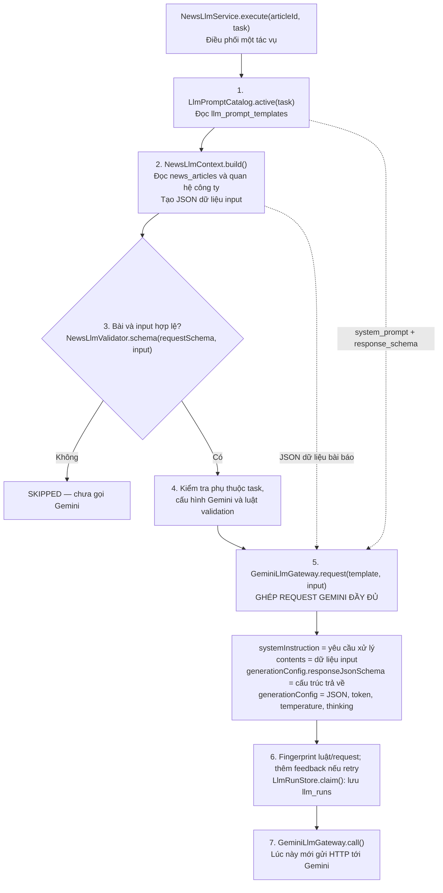
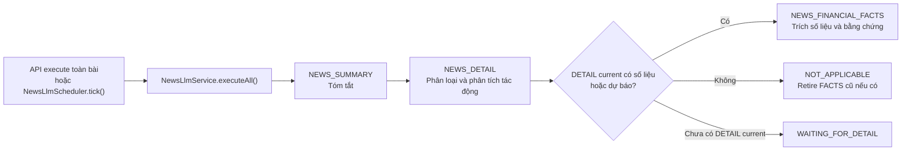

# NEWS → LLM: sơ đồ bám code

Đối chiếu code ngày 08/10/2026. Phạm vi: phân tích bài đã có nội dung, từ API/scheduler
đến kết quả đã validate. Sơ đồ mô tả implementation, không phải kết quả chạy Gemini mới.

## 1. Request được ghép đầy đủ ở đâu?

Đọc từ trên xuống. **Hai nguồn được ghép: bài báo trong DB và template trong DB.**



Ở bước 4: FACTS chờ DETAIL hoặc NOT_APPLICABLE; thiếu cấu hình/luật thì trả status
tương ứng, không tới call. Ở bước 6: CACHED/RUNNING/RETRY_LIMIT cũng dừng trước call.

| Dữ liệu | Nguồn thật | Được đặt ở đâu? |
| --- | --- | --- |
| Yêu cầu tóm tắt/phân tích/trích số liệu | llm_prompt_templates.system_prompt | systemInstruction.parts[0].text |
| Bài báo | news_articles và news_article_companies join companies/securities | contents[0].parts[0].text, chứa JSON input dạng chuỗi |
| Luật cấu trúc input | llm_prompt_templates.request_schema | Java kiểm tra trước gọi; không ghép nó thành nội dung bài |
| Cấu trúc JSON output | llm_prompt_templates.response_schema | generationConfig.responseJsonSchema sau providerSchema(); Java giữ schema đầy đủ để validate |

**Tên trường thực tế là `responseJsonSchema`**, không phải `responseSchema` trong
request Gemini hiện hành. `article`, `segments`, `companies` là các phần JSON Java
dựng, không phải bảng/cột mới. `segments` lấy nguyên văn content_text, chia đoạn và
gán p1/p2; `companies` lấy đúng các quan hệ của bài.

## 2. UML sequence: từ API đến kết quả

Sơ đồ này nối tiếp bước dựng request trên. DB là một lifeline, nhưng mỗi lệnh ghi
đã ghi rõ bảng; request provider và JSON output là hai đối tượng khác nhau.

```mermaid
sequenceDiagram
    autonumber
    actor Admin
    participant C as NewsLlmAdminController
    participant S as NewsLlmService
    participant G as GeminiLlmGateway
    participant DB as PostgreSQL
    participant AI as Gemini

    Admin->>C: POST news/{id}/tasks/{task}/execute
    C->>S: execute(id, task)
    S->>DB: catalog.active(): đọc prompt + request_schema + response_schema
    S->>DB: contexts.build(): đọc bài và quan hệ công ty
    Note over S: Dựng input; kiểm tra bài, request schema,<br/>phụ thuộc task, cấu hình và fingerprint luật
    S->>G: request(template, input)
    G-->>S: Request đầy đủ: prompt + dữ liệu + schema output
    Note over S: withValidationFeedback(): chỉ thêm lỗi lần trước<br/>nếu có retry đáp ứng điều kiện
    S->>DB: store.claim(): khóa bài/task; kiểm tra cache/run/retry
    alt CLAIMED
        DB-->>S: runId; llm_runs = RUNNING; lưu request và snapshot
        S->>G: call(request, attempt callback)
        loop Từng attempt trong giới hạn retry/deadline
            G->>AI: generateContent; model và key dùng ở tầng HTTP
            AI-->>G: HTTP response + output text
            G->>DB: callback store.recordAttempt(): llm_run_attempts
        end
        G-->>S: Reply cuối
        Note over S: Kiểm tra HTTP, output và parse JSON<br/>Lỗi vận chuyển/audit: store.fail(), không publish
        S->>DB: store.stageResponse(): lưu response; PENDING_VALIDATION
        S->>DB: store.finish(): khóa; kiểm lại source/prompt/luật
        Note over S,DB: LlmValidationService.evaluate(): luật DB + executor Java<br/>Schema đầy đủ, evidence quote, company ID, source/policy<br/>Ghi validation_results theo llm_run_id + round
        alt Không có lỗi blocking/kỹ thuật
            S->>DB: llm_runs SUCCESS; insert llm_results; đổi current trong transaction
            S-->>C: SUCCESS + runId + resultId
        else Response/nguồn không đạt
            S->>DB: llm_runs REJECTED hoặc FAILED; không tạo result mới
            S-->>C: status + issues
        end
    else CACHED / RUNNING / RETRY_LIMIT
        DB-->>S: Outcome hiện có; không gọi Gemini
        S-->>C: Outcome
    end
    C-->>Admin: Kết quả tác vụ
```

Nếu stageResponse mất quyền xử lý run: LEASE_LOST và không gọi finish. Response đã
ở PENDING_VALIDATION có thể đi qua revalidate mà không gọi Gemini lần nữa.

## 3. Một bài chạy những task nào?



SUMMARY/DETAIL là hai task riêng; executeAll gọi theo thứ tự, không có điều kiện
SUMMARY phải SUCCESS mới gọi DETAIL. Task disabled trả TEMPLATE_DISABLED. Mỗi task
có prompt, run và kết quả riêng. Scheduler tick() validate pending trước, rồi mới
chọn candidates/executeAll nếu gateway có cấu hình.

## 4. Các đường dừng, gắn đúng vị trí

| Vị trí | Trường hợp | Kết quả |
| --- | --- | --- |
| contexts.build / schema | Không body, body quá ngắn/bẩn, nguồn trùng/test, input sai | SKIPPED trước tạo run/gọi AI |
| FACTS dependency | Chưa có DETAIL / không có số liệu | WAITING_FOR_DETAIL / NOT_APPLICABLE |
| gateway / policy readiness | Thiếu key, LLM chưa bật, luật bắt buộc thiếu | CONFIGURATION_REQUIRED / VALIDATION_CONFIGURATION_ERROR |
| store.claim | Kết quả đúng fingerprint đã có / run đang xử lý / 3 run lỗi input không đổi | CACHED / RUNNING / RETRY_LIMIT |
| gateway.call | HTTP retry được hoặc timeout | Fallback có giới hạn; attempt được ghi log |
| parse/stage/finish | HTTP cuối lỗi, output không JSON, bằng chứng sai, source đổi | Lưu audit; FAILED hoặc REJECTED; không publish |
| finish | Đạt luật blocking, không lỗi kỹ thuật | SUCCESS, llm_results mới; WARNING nếu chất lượng còn hạn chế |
| pending/revalidate | Kiểm lại output đã lưu | validation round mới; không gọi Gemini |

## 5. Xem request thật trước khi gọi AI

API sẵn có: `GET /api/admin/llm/news/{articleId}/preview?task=NEWS_SUMMARY` với
admin token. `NewsLlmService.preview()` trả:

- `input`: chỉ JSON dữ liệu bài báo, tương ứng phần 2.2 của báo cáo cũ.
- `provider_request`: request Gemini đầy đủ, đã có prompt, dữ liệu và schema output.
- `response_schema`: schema đầy đủ dùng để Java validate.
- `eligible`, `issues`, `provider_configured`: đủ điều kiện hay chưa.

Preview không tạo run và không gọi Gemini. Execute có thể thêm validation feedback
từ lần trước vào contents; template/luật/nguồn cũng có thể đổi sau preview.

## 6. File code để đối chiếu

Package gốc `src/main/java/com/hethongdata/taichinh/`:

- `controller/admin/NewsLlmAdminController.java`: API preview/execute/results/revalidate.
- `service/llm/NewsLlmService.java`: preview, execute, withValidationFeedback, executeAll, validatePending.
- `service/llm/NewsLlmContext.java`: build, segmentText; mapping DB → input.
- `service/llm/LlmPromptCatalog.java`: active, seed; đọc template DB.
- `service/llm/GeminiLlmGateway.java`: request, providerSchema, call; HTTP và fallback.
- `service/llm/LlmRunStore.java`: claim, recordAttempt, stageResponse, finish, revalidate, results.
- `service/llm/LlmValidationService.java`, `NewsLlmValidator.java`: catalog luật, schema và evidence.
- `scheduler/llm/NewsLlmScheduler.java`: tick; dùng cùng service với API.

Recovery URL-only là service riêng, xem [NEWS_RECOVERY_FLOW_AND_TESTS](NEWS_RECOVERY_FLOW_AND_TESTS.md).
Financial forecast là service riêng, xem [FINANCIAL_FORECAST_ADMIN_API](FINANCIAL_FORECAST_ADMIN_API.md).
Sơ đồ này không ghép hai luồng đó vào execute NEWS thường.
