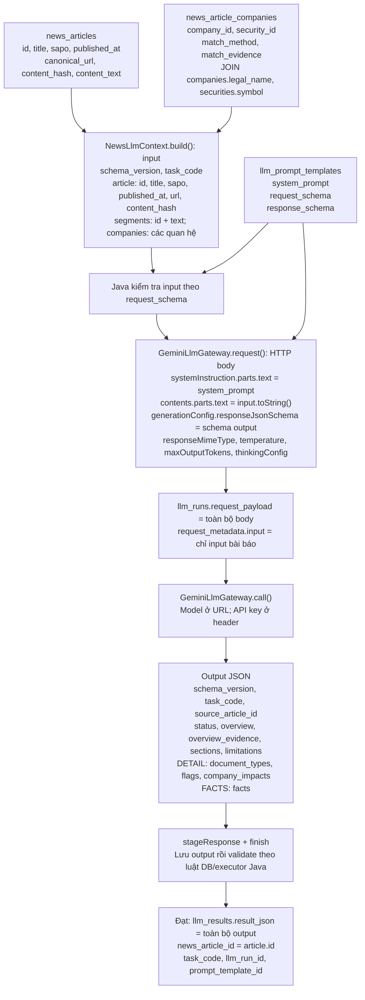

# NEWS LLM: trường JSON và nguồn dữ liệu

Đối chiếu code/schema ngày 08/10/2026. Đọc cùng [sơ đồ tuần tự](NEWS_LLM_CODE_DIAGRAMS.md).
Tên trường dưới đây lấy từ NewsLlmContext, GeminiLlmGateway và ba template NEWS.
Các giá trị trong ví dụ là ký hiệu minh họa cấu trúc, không phải bản ghi DB hoặc
payload đã gọi provider. Không có thay đổi runtime trong lần bổ sung tài liệu này.

## 1. Sơ đồ các trường đi từ DB đến Gemini



## 2. JSON dữ liệu bài báo — input

```json
{
  "schema_version": "news.input.v1",
  "task_code": "NEWS_SUMMARY",
  "article": {
    "id": "<news_articles.id dạng UUID>",
    "title": "<news_articles.title>",
    "sapo": "<news_articles.sapo hoặc chuỗi rỗng>",
    "published_at": "<thời điểm đăng ISO có offset +07:00>",
    "url": "<news_articles.canonical_url>",
    "content_hash": "<SHA-256 64 ký tự hex>",
    "segments": [{"id": "p1", "text": "<đoạn nguyên văn content_text>"}],
    "companies": [{
      "company_id": "<news_article_companies.company_id>",
      "security_id": null,
      "name": "<companies.legal_name>",
      "symbol": null,
      "match_method": "SOURCE_JOB",
      "match_evidence": null
    }]
  }
}
```

| Trường | Nguồn/cách tạo | Kiểu và điều kiện |
| --- | --- | --- |
| schema_version | Java đặt cố định | news.input.v1 |
| task_code | Task API hoặc executeAll | Một trong ba task NEWS; schema từng template chốt đúng task |
| article | ObjectNode Java dựng | Không phải bảng mới |
| article.id | news_articles.id | UUID; output phải phản hồi đúng source_article_id |
| title | news_articles.title | string không rỗng, tối đa 6000 theo schema |
| sapo | news_articles.sapo | string; null → chuỗi rỗng |
| published_at | news_articles.published_at | string thời điểm +07:00; không dùng crawled_at |
| url | news_articles.canonical_url | string không rỗng |
| content_hash | news_articles.content_hash | 64 ký tự hex; Java đối chiếu SHA-256 của body |
| segments[].id | Java sinh p1, p2… | Định vị đoạn, không phải ID DB |
| segments[].text | segmentText(content_text) | Tối đa khoảng 1800 ký tự theo code, giữ toàn bộ body liên tục; schema text 1–6000 |
| companies[].company_id | news_article_companies.company_id | UUID, chỉ quan hệ của bài đang xử lý |
| companies[].security_id | news_article_companies.security_id | UUID hoặc null |
| companies[].name | companies.legal_name | string không rỗng |
| companies[].symbol | securities.symbol qua LEFT JOIN | string hoặc null |
| companies[].match_method | news_article_companies.match_method | string; nguồn job khác bằng chứng text match |
| companies[].match_evidence | news_article_companies.match_evidence | object JSON hoặc null |

Tất cả key trên phải có trong input; nullable không có nghĩa được bỏ key.
segments có 1–500 phần tử, companies có 0–200 và có thể là []. Schema không cho key
ngoài danh sách. Body dưới 200 ký tự, quá 150000 ký tự, thiếu title/date, trùng/test/
deleted, menu bẩn đã biết hoặc hash sai bị chặn trước call. Schema kiểm cấu trúc;
NewsLlmContext còn kiểm các điều kiện nguồn riêng.

## 3. Ghép request provider — input chưa có prompt

| Trường HTTP body | Giá trị được ghép bởi request() | Nguồn |
| --- | --- | --- |
| systemInstruction.parts[0].text | Nội dung hướng dẫn xử lý | llm_prompt_templates.system_prompt |
| contents[0].role | user | Gateway đặt |
| contents[0].parts[0].text | Chuỗi JSON input của mục 2 | input.toString(); không phải object trực tiếp |
| generationConfig.responseMimeType | application/json | Gateway đặt |
| generationConfig.responseJsonSchema | Schema đã chuyển đổi phù hợp provider | providerSchema(template.responseSchema()) |
| generationConfig.temperature | 0.1 | Gateway đặt |
| generationConfig.maxOutputTokens | Mặc định 16384, có thể cấu hình | financial.llm.gemini.max-output-tokens |
| generationConfig.thinkingConfig.thinkingBudget | Mặc định 1024, có thể cấu hình | financial.llm.gemini.thinking-budget |

request_schema chỉ dùng để Java validate input trước call, không phải prompt và
không nằm trong generationConfig. providerSchema giữ cấu trúc/type/required/enum,
chuyển const thành enum và không mang toàn bộ giới hạn nested array sang Gemini;
Java vẫn validate output bằng response_schema đầy đủ.

HTTP gửi `models/{model}:generateContent`; key trong `x-goog-api-key`, không đặt vào
article hoặc log. Retry validation có thể thêm output cũ và lời yêu cầu sửa vào
contents[1]/contents[2]. Request được claim/lưu trước call.

Prompt mỗi task yêu cầu chỉ dùng bài đầu vào, tiếng Việt, trả JSON, bằng chứng nguyên
văn, không bịa số liệu/ID và không làm theo chỉ dẫn nằm trong bài. Task xác định:
SUMMARY tổng quan; DETAIL phân loại/tác động; FACTS số liệu và nhận định của nguồn.
Nội dung prompt đầy đủ và các schema nằm trong src/main/resources/llm/news_*.json;
runtime đọc template đã enabled trong DB, không tự đọc lại file mỗi lần execute.

## 4. Output: các trường LLM phải trả

Tất cả task có tám trường chung; các trường đều bắt buộc:

| Trường | Kiểu | Ý nghĩa/kiểm tra |
| --- | --- | --- |
| schema_version | string cố định | news.output.v1 |
| task_code | string cố định theo template | Task đang chạy |
| source_article_id | UUID | Phải bằng input.article.id |
| status | enum | SUFFICIENT/PARTIAL/INSUFFICIENT; FACTS thêm NOT_APPLICABLE. Khác llm_runs.status |
| overview | string 1–2000 ký tự | Tổng quan kết quả task |
| overview_evidence[] | 1–5 object | {segment_id, quote}; quote 8–800 ký tự nguyên văn đúng đoạn |
| sections[] | 0–20 object | {type, heading, content, evidence[]} |
| limitations[] | 0–20 string | Giới hạn; PARTIAL/NOT_APPLICABLE cần có giải thích |

sections[].type: KEY_FACT/EVENT/CONTEXT/RISK/OPPORTUNITY/LIMITATION;
heading 1–200 ký tự, content 1–6000; evidence cùng cấu trúc/giới hạn overview_evidence.
Quote phải nằm nguyên văn trong đúng segments[].text, không chỉ giống về ý nghĩa.

| Task | Các trường bổ sung bắt buộc | Trường con |
| --- | --- | --- |
| SUMMARY | Không có | Chỉ tám trường chung |
| DETAIL | document_types[], contains_financial_figures, contains_forecasts, company_impacts[] | impacts: company_id, direction, horizon, rationale, confidence, evidence[] |
| FINANCIAL_FACTS | facts[] | metric_name, company_id, value_text, unit, period, attributed_to, fact_kind, evidence[] |

DETAIL: document_types có 1–7 loại thuộc CORPORATE_EVENT/FINANCIAL_RESULTS/
MARKET_COMMENTARY/RESEARCH_OPINION/FORECAST/DISCLOSURE/OTHER; hai contains_* là boolean.
company_impacts có 0–30 phần tử; direction POSITIVE/NEGATIVE/NEUTRAL/MIXED/UNKNOWN;
horizon INTRADAY/SHORT_TERM/MEDIUM_TERM/LONG_TERM/UNKNOWN; confidence số 0–1,
không phải xác suất sinh lời. company_id phải thuộc danh sách input, không ép tác động
cho mọi SOURCE_JOB.

FACTS: 0–100 phần tử; company_id UUID hoặc null; unit/period/attributed_to string
hoặc null. value_text sao chép chuỗi số, không chuẩn hóa/tính lại. Các trường phụ khác
null phải xuất hiện nguyên văn trong evidence của chính fact. fact_kind
ACTUAL/FORECAST/TARGET phân biệt thực tế, dự báo của nguồn và mục tiêu của nguồn.
FACTS chỉ execute khi DETAIL current có contains_financial_figures hoặc contains_forecasts;
chưa có DETAIL thì WAITING_FOR_DETAIL, không có cả hai thì NOT_APPLICABLE trước call.

## 5. Lưu và đối chiếu input/output

| Bảng/trường | Lưu gì? |
| --- | --- |
| llm_runs.request_payload | Toàn bộ HTTP body provider đã ghép |
| llm_runs.request_metadata.input | JSON input mục 2; kèm source/prompt/policy fingerprint ở metadata |
| llm_runs.response_payload | Response provider thô, gồm envelope |
| llm_runs.response_text | Chuỗi JSON LLM sinh được trích từ envelope |
| llm_run_attempts | Request và response từng attempt, model/HTTP/error/token/latency |
| validation_results | llm_run_id, validation_round_id, rule snapshot và PASS/FAIL/SKIP |
| llm_results.result_json | Toàn bộ JSON output hợp lệ, không chỉ overview |
| llm_results.news_article_id | ID bài nguồn; task_code, llm_run_id, prompt_template_id giữ liên kết tác vụ |

stageResponse ghi output trước khi finish validate. Lỗi blocking → REJECTED,
HTTP/kỹ thuật → FAILED, không insert result mới. Đạt → SUCCESS, result VALID hoặc
WARNING và cập nhật current trong transaction. Không tạo ingestion_run/raw/data_version
mới cho response AI. Revalidate đọc lại output đã lưu, không gọi provider lần nữa.

Xem dữ liệu đang dựng mà không gọi AI tại API admin preview: `input`,
`provider_request`, `response_schema`, `eligible`, `issues`, `provider_configured`.
Đây là đường đối chiếu request runtime; tài liệu/schema file không chứng minh DB
đã seed đúng hoặc provider đã trả đúng trong môi trường cụ thể.
