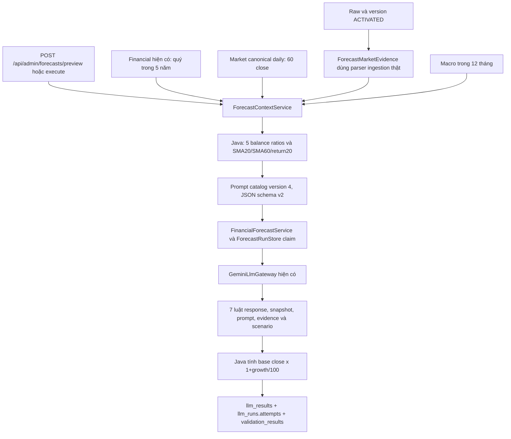

# Financial + market + macro → kịch bản giá cuối quý

Cập nhật 10/10/2026, Asia/Ho_Chi_Minh. Branch `feature/stock-price-scenarios`
được xây từ `feature/llm-processing` commit `010dd89` trong checkout riêng;
không sửa worktree NEWS của AI khác, chưa merge lên master.

## Kỳ dự báo

`horizonQuarters=1` nghĩa là cuối **quý kế tiếp**, không phải cuối quý đang diễn
ra, ngày mai hoặc tháng sau. Ví dụ asOfDate 09/10 hoặc 10/10/2026 → 31/03/2027.
Horizon 2 → 30/06/2027. Hỗ trợ 1–8 quý tương lai. `ForecastHorizon` dùng cùng quy
ước cho cả financial và giá; đã sửa lỗi horizon trùng kỳ tại ngày cuối quý.
Ngày đích là ranh giới kỳ lịch, không khẳng định ngày đó có phiên giao dịch;
giá cuối quý được hiểu cho phiên giao dịch cuối kỳ. Chưa mô hình hóa lịch nghỉ sàn.

## Luồng thật và hợp đồng



Không thêm fetcher hoặc model tự dựng để ghi dữ liệu. Đọc market/financial/macro
đã được pipeline hiện có nạp. API, provider, audit, cache/retry và validation dùng
chính luồng forecast hiện có; không có endpoint bypass validator để chèn dự báo.
Không cần thay Python/Vercel cho việc bổ sung target này.

`ForecastRequest.targets` hỗ trợ 6 mã: NET_PROFIT_AFTER_TAX, PRETAX_PROFIT,
TOTAL_ASSETS, OWNERS_EQUITY, LIABILITIES, **STOCK_PRICE**. Có thể yêu cầu price-only
hoặc kết hợp cả sáu. Với STOCK_PRICE, `base_point_id` phải là MARKET/CLOSE mới nhất,
khác financial target dùng điểm báo cáo đúng loại. Đầu vào `financial.forecast.input.v2`
có thêm horizon_quarters và horizon_basis. Prompt version 4, output schema
`financial.forecast.output.v2`; enum có đúng sáu mã. Bản catalog version 2 đã được
seed trong bước preview nhưng chưa dùng gọi LLM, chứa enum STOCK_PRICE lặp;
bản 3 loại lặp, giữ nguyên schema v2, không ghi đè lịch sử immutable.

Mỗi forecast giữ cấu trúc chung:

```text
metric_code: STOCK_PRICE
base_point_id: PRICE:<id thật>
bear/base/bull:
    growth_percent
    rationale
    evidence_ids
```

Mỗi scenario cần close nền và ít nhất một close lịch sử khác. ID phải tồn tại
trong input; bear growth <= base growth <= bull growth. Growth price phải >-100,
<=300; không chấp nhận dự kiến giá bằng/nhỏ hơn 0. Response còn overview,
macro_used, risks, limitations và status. Macro_used phải khớp evidence thực.

Java bổ sung `calculated_values` với metric_code=STOCK_PRICE, unit=VND_PER_SHARE,
base_value, base_point_id, source_period_end, forecast_period_end, bear/base/bull,
formula=`base_value * (1 + growth_percent / 100)`, calculation_version=scenario-v1.
Giá trị này là giả định kịch bản, không được ghi vào market_prices hoặc financial_metrics.

## Giá nền và chỉ báo Java

Chỉ canonical daily, close dương, có sẵn trước cutoff Việt Nam; tối thiểu 60 phiên,
không trùng trading date, close nền không cũ quá 15 ngày lịch. Mọi close dùng cho
price phải chứng minh đúng đơn vị VND/share và khớp raw thật qua parser giá hiện có,
raw đúng mã/nguồn và data_version ACTIVATED domain MARKET_PRICE thuộc cùng run.
Không khớp → preview ineligible, execute SKIPPED trước provider.

Legacy vnstock/vndirect/cafef dùng multiplier VND đã có trong production parser;
normalized market_price.v1 phải khai price_unit=VND. Không coi close lớn/nhỏ là
bằng chứng đơn vị. Giá sử dụng là nominal close chưa điều chỉnh corporate actions.

Ngoài 5 balance ratios, Java tạo chỉ báo mô tả từ các close đã chứng minh:

| Code | Công thức | Đơn vị |
| --- | --- | --- |
| SMA_20 | Bình quân 20 close gần nhất | VND/share |
| SMA_60 | Bình quân 60 close gần nhất | VND/share |
| PRICE_RETURN_20_SESSIONS | (Close mới nhất / close 20 phiên trước − 1) × 100 | % |

Tất cả có sourcePointIds và công thức. Không lưu các chỉ báo price vào financial_metrics
như số liệu doanh nghiệp. Không tuyên bố chúng là thuật toán dự báo đã backtest.

## Kiểm thử và runtime

Đợt localhost mở rộng: **32 integration + 146 regression pass, 4 skipped**;
revalidate output thật giữ audit 14 rows với 7 PASS ở validationRoundId hiện hành,
8 concurrent cache requests không gọi model mới. Test cutoff/provenance/giá cũ,
claim đồng thời và response sai đạt. Xem
[biên bản đầy đủ](FORECAST_LOCALHOST_VERIFICATION_20261010.md). Các số 18 integration
bên dưới là bằng chứng đợt sửa prompt trước đó.

- Regression: 150 tests được xét, 146 pass, 4 opt-in skipped; không chạy tests cũ
  có thể ghi mẫu vào DB nghiệp vụ. Không có failure/error.
- Forecast integration sau sửa prompt v4: 18 pass, PostgreSQL schema `forecast_test_<uuid>` cô lập,
  source copy từ DB thật, Gemini **mock**. Có kiểm tra API sáu targets, unit/raw
  mismatch, zero price rejection, đầy đủ audit, arithmetic, cache, evidence sai,
  auth và retry cap. Thêm kiểm tra macro có sẵn nhưng không cite phải REJECTED nếu
  macro_used=true; có cite đúng và flag true thì publish/cache. Mẫu response chỉ
  vào schema test, đã cleanup. Regression 146 pass là bằng chứng trước sửa prompt,
  không chạy lại toàn bộ regression trong đợt này.
- Horizon tests: quarter-end, leap year, year boundary, horizon 1/2/8; nằm trong regression.
- Maven package thành công. Runtime local `127.0.0.1:8182`, PID ở ignored
  `target/stock-price-release/java.pid`. Các scheduler/seeder tự động tắt.
- Preview FPT asOfDate 10/10/2026: eligible=true, 19 kỳ financial, 60 phiên giá,
  10 observations macro; close nền 59.700 VND/share ngày 08/10/2026;
  forecast_period_end=31/03/2027, đầy đủ 8 mã derived metrics.
- Live 10/10/2026 sau cập nhật private config và prompt v4: run
  `c1d02bfd-5caa-4268-b603-cd11a865bedf` SUCCESS, Gemini HTTP 200, đủ 6 targets,
  7 luật PASS, arithmetic/evidence và replay CACHED đạt. Model đầu timeout rồi
  gateway fallback gemini-3.5-flash-lite thành công; 2 attempts được audit.
  Price bear/base/bull 53.730 / 60.894 / 66.864 VND/share cho 31/03/2027,
  dựa close 59.700. Input có 10 macro, output không cite nên macro_used=false.
  Kết quả vẫn WARNING/PARTIAL, chưa backtest/calibrate. Lần 403 trước đó và
  response v3 REJECTED do macro flag mismatch được giữ nguyên audit. Xem
  [biên bản chạy và WARNING](FORECAST_LIVE_CHECK_20261010.md).

Lệnh nghiệm thu đã chạy sau chấp thuận của người dùng và cập nhật cấu hình:

```powershell
python scripts/verify_stock_price_live.py --symbol FPT --as-of 2026-10-10
```

Script chỉ gọi `/api/admin/forecasts`: seed → preview → execute → read run/result
→ execute lại để kiểm cache. Không tự gọi model, không fetch nguồn ngoài pipeline,
không ghi trực tiếp DB. Kiểm 6 targets, evidence, phép tính Decimal và 7 luật PASS.
Evidence đầy đủ trong ignored `target/stock-price-release/FPT-live.json`.

Kiểm nghiệm mở rộng có thể thêm `--revalidate --extended-checks`. Run API trả
`validationRoundId`; công cụ nghiệm thu dùng đúng vòng này và giữ mọi vòng audit,
không yêu cầu cả lịch sử chỉ có 7 rows sau revalidation. Các historical previews
chỉ đánh giá readiness/cutoff, không sinh backtest hoặc tự gọi model cho từng kỳ.

Admin token/config private không vào Git. Không cần migration schema nghiệp vụ mới;
seed prompt mới qua API, version cũ giữ để audit. Bản root/port khác còn code cũ
phải được cập nhật trước khi dùng contract/horizon mới; không tự restart runtime NEWS.

## Giới hạn

LLM đề xuất growth có bằng chứng, Java làm arithmetic. Đây là **kịch bản giá chưa
hiệu chuẩn**, không phải fair value, dự báo có xác suất, total return hay khuyến nghị
mua/bán. Chưa dự báo corporate actions/cổ tức; không dùng lịch sử unadjusted để
tuyên bố lợi suất adjusted. Financial scope và riêng quý/lũy kế còn thiếu xác minh;
macro chưa có historical release/vintage dates. PARTIAL/WARNING được giữ theo
những hạn chế này. Không tự thêm EPS/PE/PB/DCF từ input chưa đủ.

Đề xuất dữ liệu/báo cáo cho nhà phân tích: [ANALYST_DATA_REQUIREMENTS.md](ANALYST_DATA_REQUIREMENTS.md).
